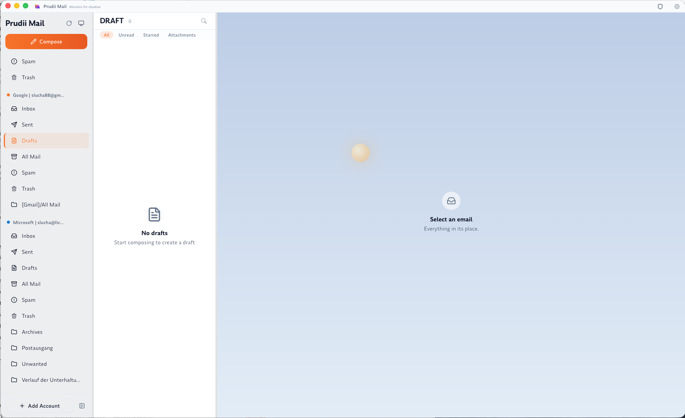
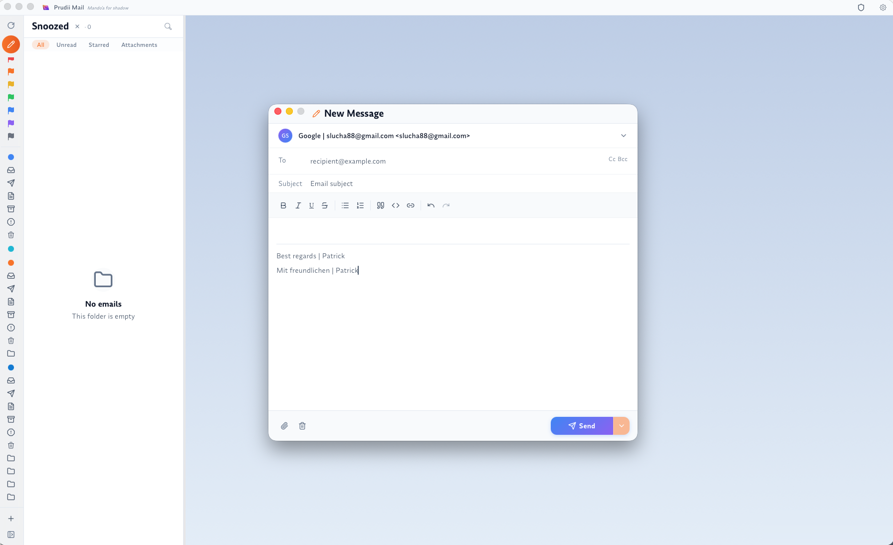

<p align="center">
  
</p>

<h1 align="center">Prudii Mail</h1>

<p align="center">
  <strong>Private, tracker-blocking email — native, fast, and entirely yours.</strong>
</p>

<p align="center">
  <a href="https://prudii.com">Website</a>
  ·
  <a href="https://prudii.com/#download">Download</a>
  ·
  <a href="https://github.com/sLuCHaa/prudii-app/releases/latest">Latest release</a>
</p>

<p align="center">
  <a href="https://github.com/sLuCHaa/prudii-app/releases/latest"></a>
  
  
  
  <a href="https://github.com/sponsors/sLuCHaa"></a>
</p>

<p align="center">
  
</p>

---

> // I looked at every email client on Windows. They all sucked. So I built my own.

**Prudii keeps your mail where it belongs — on your machine.** No cloud, no telemetry, no trackers watching you read. Just you and your inbox.

## ✨ Why Prudii

- 🛡️ **Tracker blocker, on by default** — detects and strips tracking pixels, hidden images, and **70+ known tracker domains**, so senders can't tell when (or whether) you opened their mail.
- 🔒 **Everything local** — your emails live on your machine, not in someone's cloud. No server ever sees them.
- 🔑 **Passwords encrypted at rest** — Windows DPAPI · macOS Keychain · Linux keyring. Other apps can't touch them.
- 📥 **All your accounts, one inbox** — Gmail, Outlook / Microsoft 365, iCloud, Fastmail, GMX, any IMAP/SMTP.
- ⚡ **Native & fast** — Rust + Tauri, not Electron. Starts in seconds, sips memory.
- 🤖 **Local AI (optional)** — summaries and reply suggestions via [Ollama](https://ollama.com) on *your* machine. No cloud, no API keys, nothing leaves your network.
- 🔍 **Instant full-text search** — across every account, offline.
- 🌍 **Speaks your language** — English, Deutsch, Español, Français, Português, Русский, 中文.
- 🌗 dark & light · 🔄 signed auto-updates · 💾 ZIP backup & restore.

<p align="center">
  
</p>

## 🔐 I don't want your data

There's no server for your mail. The only thing that ever talks to `prudii.com` is an optional license check for paid plans — and even then your emails never leave your machine.

- No server · no tracking · no telemetry
- External images blocked, tracking pixels stripped
- AI runs locally via Ollama — nothing leaves your network
- Direct IMAP/SMTP — no proxy in the middle

## ⬇️ Download

Grab it from the [website](https://prudii.com/#download) or the [Releases](https://github.com/sLuCHaa/prudii-app/releases/latest) page:

| Windows | macOS | Linux |
|:--:|:--:|:--:|
| `.exe` · `.msi` | `.dmg` — Apple Silicon **&** Intel | `.deb` · `.rpm` · `.AppImage` |

Installers are **signed & notarized**, and the app **updates itself**. It's free. If you like it, [sponsor me](https://github.com/sponsors/sLuCHaa). If you don't, get something else — no hard feelings.

## 🧠 Heads up — it's a hobby project

I build this in my spare time, on energy drinks and good vibes. There's no big company behind it. It's free and it works today. Paid plans (Premium, Team) are on the roadmap but a long way off yet — and the free version isn't going anywhere either way. This isn't one of those "free until you need it" things.

## 🛠️ Build it yourself

You'll need **Node.js 20+**, **pnpm**, **Rust (stable)**, and the [Tauri 2 prerequisites](https://tauri.app/start/prerequisites/).

```bash
pnpm install
pnpm tauri dev      # dev mode (Vite + Rust backend)
pnpm tauri build    # production build / installer
pnpm bump 1.2.3     # sync the version across package.json, Cargo.toml, tauri.conf.json
```

> **Gmail OAuth secret** isn't in this repo. It's injected at compile time from `PRUDII_GOOGLE_CLIENT_SECRET` (env var or a git-ignored `src-tauri/.env.local`). Builds without it still compile — Gmail sign-in just won't work in that build.

## 🧩 Under the hood

- **Frontend** — React 19, TypeScript, Vite, Tailwind CSS 4, Zustand, TanStack Query, TipTap, i18next
- **Backend** — Rust, Tauri 2, SQLite + FTS5, Tokio, Lettre (SMTP), mail-parser
- **Updates** — cryptographically signed via the Tauri updater, published straight from GitHub Releases

## 🌑 Why "Prudii"?

*Prudii* is Mando'a for *shadow* — from the Mandalorian language. Just you and your inbox, in the shadows.

## 📄 License

The source is public so you can read it and confirm it does exactly what I say it does. It's **not** open source, though: look and build it for yourself, but no redistribution, no commercial use, and no ripping out the license check. Full terms in [LICENSE](LICENSE).

---

<p align="center"><sub>Built with Rust, Tauri, React, and too many energy drinks.</sub></p>
